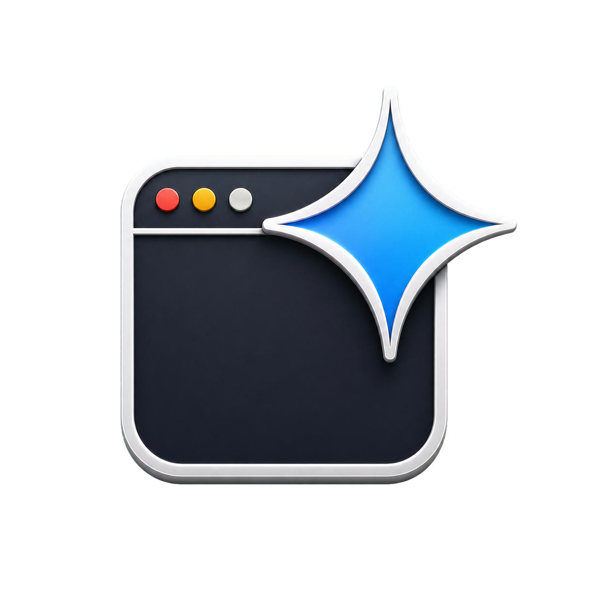
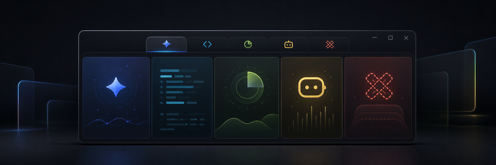
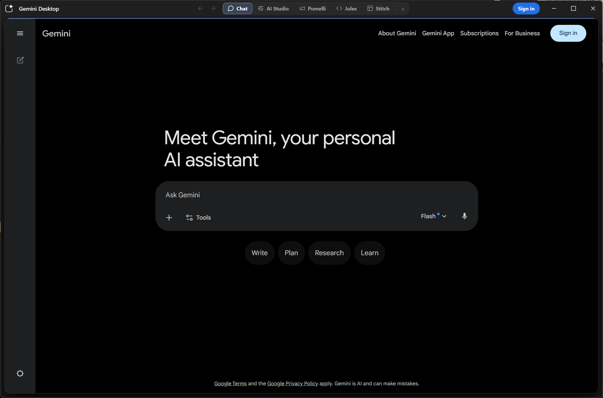
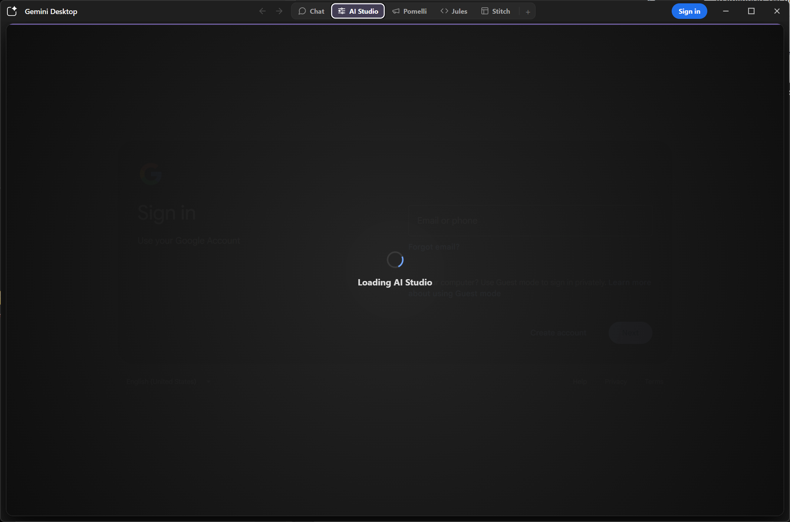
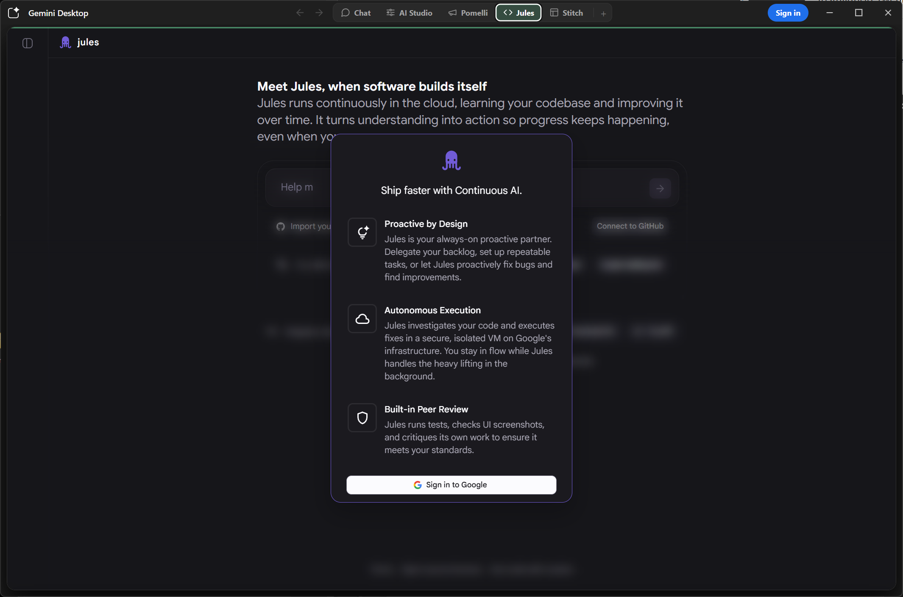
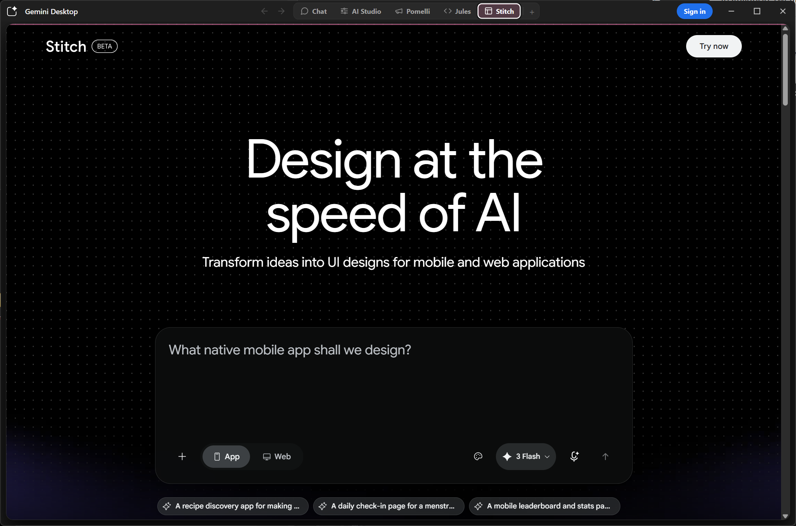
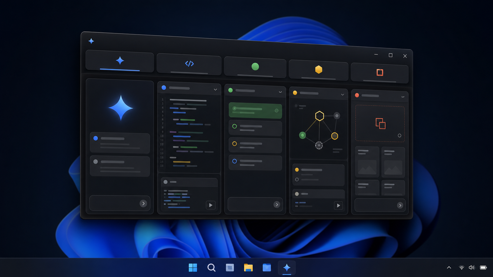

<div align="center">



# Gemini Desktop

**One desktop home for Google's AI suite.**

A Windows · macOS · Linux desktop client that bundles **Gemini, AI Studio, Pomelli, Jules, and Stitch** into a single window — with one shared Google sign-in across every tool.

<p>
  <a href="https://github.com/sgeraldes/gemini-app/releases/latest"></a>
  <a href="https://github.com/sgeraldes/gemini-app/releases"></a>
  
  <a href="https://github.com/sgeraldes/gemini-app/actions/workflows/release.yml"></a>
  <a href="LICENSE"></a>
  <a href="https://github.com/sgeraldes/gemini-app/stargazers"></a>
</p>








</div>

---

## Why

Google's AI tools are powerful but scattered across browser tabs, where they get buried, lose their own window, and don't survive a restart cleanly. Gemini Desktop gives the whole suite an OS-level home: one window, one taskbar/dock entry, one persistent sign-in, and instant switching between tools — no URLs to type.

It's built on Electron. Each tool runs in its own persistent `<webview>`, and they all share a single Google session via the `persist:google` partition.



## Features

- **Unified tool switcher** — a centered tab strip switches between Gemini (Chat), AI Studio, Pomelli, Jules, and Stitch. Each tool has its own subtle monochrome icon and a per-tool accent colour.
- **Animated selector** — the active-tab pill slides between tools and the accent colour cross-fades; that colour also propagates to a thin line along the top of the content frame.
- **Shared Google session** — sign in once; every tool reuses the same account via the `persist:google` Electron partition.
- **Account avatar** — the top-right button shows your Google profile photo when signed in (with an animated loading state while it resolves), or a **Sign in** pill when signed out.
- **Custom tools** — pin additional Google tools with the **+** button (restricted to `https` URLs on `google.com` / `withgoogle.com`).
- **Native-style title bar** — frameless window with a custom title bar: the app icon opens the application menu (standard Windows behaviour), browser-style back/forward arrows sit beside the tabs, and standard minimize / maximize / close caption buttons live top-right.
- **Right-click context menu** — copy, paste, open/copy links, copy images, back / forward / reload, and inspect element, across the main window and every webview.
- **Chrome-flavoured User-Agent** — Electron/app product tokens are stripped from the UA so Google endpoints (notably AI Studio's makersuite APIs, which otherwise return `403 PERMISSION_DENIED`) treat the app like Chrome.
- **Passkey / WebAuthn support** — hybrid transport and remote-desktop WebAuthn features are enabled for Google sign-in.

## Download

Grab the latest build for your platform from the **[Releases page](https://github.com/sgeraldes/gemini-app/releases/latest)**.

| Platform | File | Notes |
| -------- | ---- | ----- |
| **Windows** | `Gemini Desktop Setup <version>.exe` | NSIS installer; installs per-user to `%LOCALAPPDATA%\Programs\Gemini Desktop`. |
| **macOS** | `Gemini Desktop-<version>.dmg` | Unsigned. First launch: right-click → **Open**, or run `xattr -cr "/Applications/Gemini Desktop.app"`. |
| **Linux** | `Gemini Desktop-<version>.AppImage` / `.deb` | `chmod +x` the AppImage and run it, or install the `.deb` with `apt`. |

> Builds are produced automatically by GitHub Actions on each tagged release. macOS and Linux builds are **unsigned** — see the notes above to get past the OS gatekeeper.

## Run from source

```bash
npm install
npm start
```

## Build locally

```bash
# Installer / package for the current OS
npm run dist

# Unpacked build only (no installer)
npm run pack
```

Artifacts are written to `release/`.

## Included tools

| Tool      | Tab label | URL                                   |
| --------- | --------- | ------------------------------------- |
| Gemini    | Chat      | `https://gemini.google.com/app`       |
| AI Studio | AI Studio | `https://aistudio.google.com/apps`    |
| Pomelli   | Pomelli   | `https://labs.google.com/u/0/pomelli` |
| Jules     | Jules     | `https://jules.google.com/session`    |
| Stitch    | Stitch    | `https://stitch.withgoogle.com/`      |

Custom tools added with the **+** button are persisted locally and must be served from `google.com` or `withgoogle.com` over `https`.

## Google sign-in

On first launch, if no Google session is detected the app navigates to the Google account chooser. Signing in uses the shared Electron partition `persist:google`, so every tool reuses the same account session. Use **Sign out** in the account menu (the avatar button, top-right) to clear that shared local session. The auto-redirect to sign-in only happens once per launch, so a deliberate sign-out won't trap you on the login page.

## Project structure

```
src/
  main.js       Electron main process: window, session/UA, context menu, IPC
  preload.js    contextBridge API exposed to the renderer
  renderer.js   Tool switching, title bar UI, auth/avatar, custom tools
  index.html    App shell markup
  styles.css    Title bar, tool switcher, and content-frame styling
  assets/       App icon
build/          electron-builder resources (icon)
docs/           README assets (logo, screenshots)
.github/        Release build workflow
```

## Disclaimer

Gemini Desktop is an unofficial, independent project. It is not affiliated with, endorsed by, or sponsored by Google. "Gemini", "AI Studio", "Pomelli", "Jules", and "Stitch" are products and trademarks of Google LLC. All tool content is loaded directly from Google's own web properties.

## License

[MIT](LICENSE)
